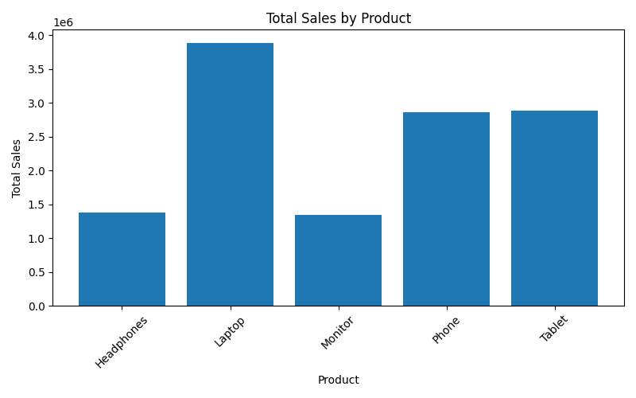
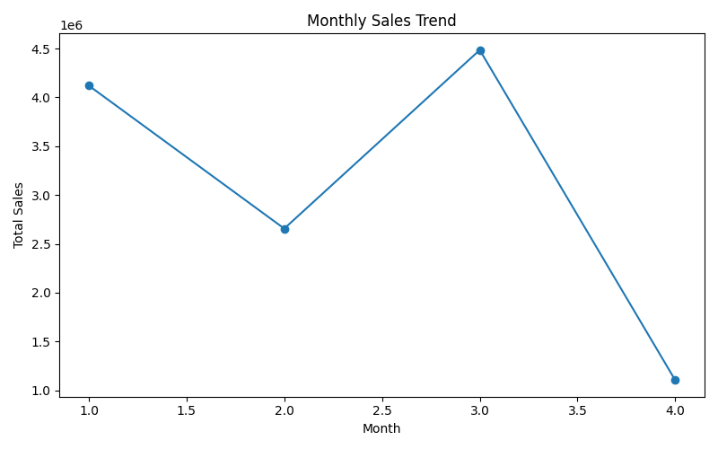
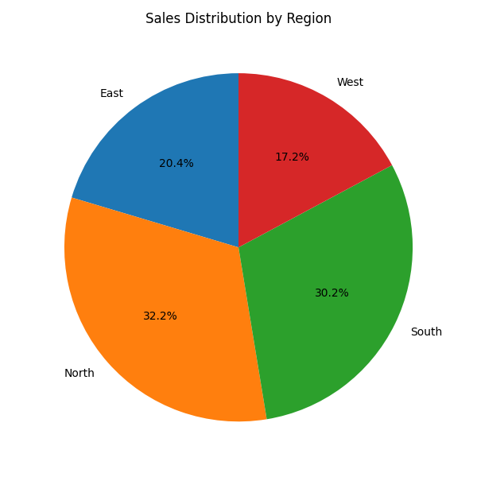

# 📊 Sales Data Analysis & Visualization using Python  
**Week 4 – Data Visualization Project**

---

## 🔍 Project Summary
This project showcases a complete **data analysis + visualization pipeline** using Python.  
The focus is not just on plotting charts, but on **deriving actionable insights from raw sales data** through structured preprocessing, aggregation, and visual storytelling.

The project follows **industry-style project organization**, reproducibility standards, and clean analytical logic.

---

## 🎯 Problem Statement
Businesses often collect sales data but fail to extract insights due to:
- Poor data cleaning
- Unstructured analysis
- Ineffective visual communication

This project solves that by converting raw transactional data into **decision-ready insights**.

---

## 🧠 Key Objectives
- Perform structured exploratory data analysis (EDA)
- Compute key business metrics
- Visualize trends, distributions, and comparisons
- Follow professional GitHub project standards
- Generate reusable, presentation-ready charts

---

## 🛠️ Tech Stack & Tools
| Category | Tools |
|-------|------|
| Language | Python 3 |
| Data Handling | Pandas, NumPy |
| Visualization | Matplotlib |
| Version Control | Git, GitHub |
| OS | Cross-platform |

---
## 📊 Visualizations

### Sales by Product

### Monthly Sales Trend

### Sales by Region

## 📁 Project Structure
